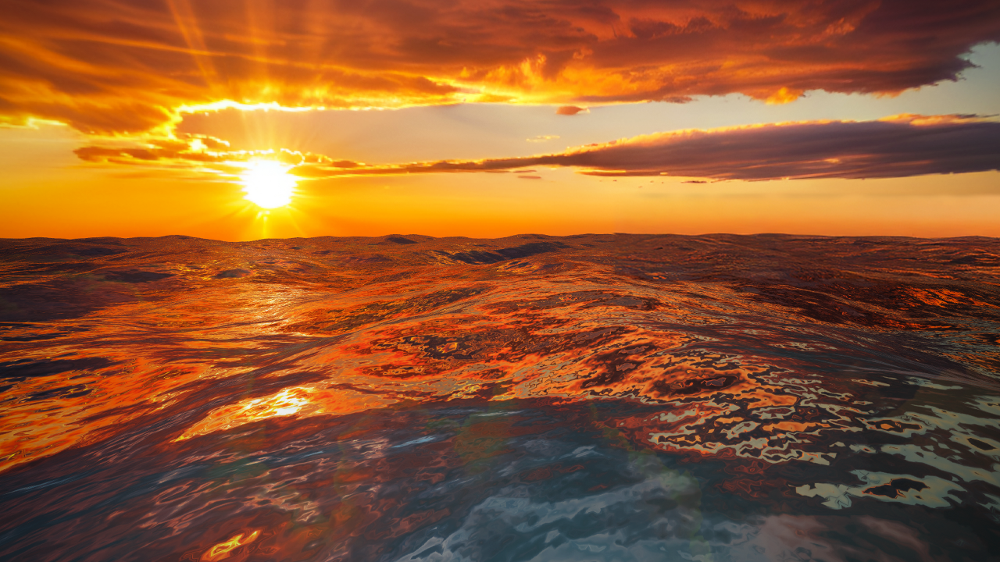

# ShipStrike-3D

> A high-performance 3D naval combat game built with Three.js, featuring advanced water physics, real-time shader effects, and dynamic naval warfare gameplay.

<p align="center">
  
</p>

## 📋 Table of Contents

- [Overview](#overview)
- [Features](#features)
- [Getting Started](#getting-started)
- [Project Structure](#project-structure)
- [Gameplay Mechanics](#gameplay-mechanics)
- [Core Systems](#core-systems)
- [Graphics & Shaders](#graphics--shaders)
- [Controls](#controls)
- [Configuration](#configuration)
- [Development](#development)
- [Performance Optimization](#performance-optimization)
- [Technology Stack](#technology-stack)
- [Contributing](#contributing)
- [License](#license)

## Overview

ShipStrike-3D is an immersive 3D naval combat game where players command a warship in real-time battles against AI-controlled enemies. The game features stunning visuals powered by advanced water shaders, dynamic particle effects, and physics-based naval combat mechanics. Built entirely with Three.js and WebGL, it delivers high-performance 3D graphics directly in the browser.

The project showcases:

- **Advanced water simulation** with fractal noise-based wave generation
- **Real-time naval combat** with cannon fire, damage systems, and ship sinking
- **Dynamic visual effects** including caustics, foam, and particle explosions
- **Optimized rendering** for smooth 60+ FPS gameplay
- **Interactive parameter tuning** via Tweakpane for live shader adjustment

## Features

### 🌊 Advanced Water Shader

- **Fractal Noise Waves**: Procedurally generated ocean waves using Perlin noise with multiple octaves
- **Dynamic Wave Physics**: Adjustable amplitude, frequency, speed, and persistence parameters
- **Realistic Reflections**: Environment map reflections with Fresnel effect and distortion
- **Caustics Effects**: Animated caustic patterns projected onto the ocean floor
- **Foam Simulation**: Dynamic foam generation based on wave height and movement
- **Subsurface Scattering**: Realistic light penetration through water surface

### ⚔️ Naval Combat System

- **Player-Controlled Warship**: Command a fully-armed naval vessel with turret aiming
- **AI Enemy Ships**: Multiple intelligent enemies that patrol, pursue, and engage
- **Cannon Combat**: Fire projectiles with physics-based trajectory and impact detection
- **Damage & Health**: Realistic ship damage model with visible destruction and health bars
- **Ship Sinking**: Ships gradually sink when critically damaged with particle effects
- **Ship Separation**: Collision avoidance system prevents overlapping vessels

### 📹 Advanced Camera System

- **Free Camera Mode**: Full 3D exploration with mouse and keyboard control
- **Lock-On Mode**: Automatic camera targeting with mouse-X yaw control
- **Smooth Following**: Cinematic camera follow with momentum and interpolation
- **Multiple Views**: Easy switching between different camera modes

### ✨ Visual Effects

- **Real-Time Particles**: Explosion effects, water splashes, and firing effects
- **Bloom Post-Processing**: Glowing light effects for enhanced visuals
- **Dynamic Coloring**: Wave surface colors that change based on height
- **Turret Smoke**: Visual feedback for cannon firing with recoil animation
- **Water Distortion**: Dynamic surface distortion around ship movement

### 🎮 Interactive UI

- **Live Parameter Control**: Tweakpane UI for adjusting shader parameters in real-time
- **FPS Counter**: Real-time performance monitoring
- **Settings Persistence**: Shader settings saved to localStorage
- **HUD System**: On-screen game information and status updates

## Getting Started

### Prerequisites

- **Node.js**: v16 or higher
- **npm**: v7 or higher
- Modern web browser with WebGL2 support

### Installation

1. **Clone the repository**

   ```bash
   git clone <repository-url>
   cd ShipStrike-3D
   ```

2. **Install dependencies**

   ```bash
   npm install
   ```

3. **Start the development server**

   ```bash
   npm run dev
   ```

   The game will be available at `http://localhost:5173`

### Building for Production

```bash
npm run build
```

This creates an optimized build in the `dist/` directory.

### Preview Production Build

```bash
npm run preview
```

## Project Structure

```
ShipStrike-3D/
├── src/
│   ├── main.js                 # Game loop and initialization
│   ├── ui.js                   # Tweakpane UI setup and shader controls
│   ├── core/
│   │   ├── config.js           # Game configuration constants
│   │   ├── renderer.js         # Three.js scene, camera, lighting setup
│   │   ├── state.js            # Global game state management
│   │   └── textures.js         # Texture loading utilities
│   ├── entities/
│   │   ├── player.js           # Player ship logic and controls
│   │   ├── enemy.js            # AI enemy ship behavior
│   │   └── ship.js             # Base ship class shared functionality
│   ├── systems/
│   │   ├── camera.js           # Camera modes and following logic
│   │   ├── combat.js           # Cannon fire, projectiles, damage
│   │   ├── healthbar.js        # Ship health visualization
│   │   ├── hud.js              # Heads-up display rendering
│   │   ├── input.js            # Keyboard and mouse input handling
│   │   └── particles.js        # Particle effect system
│   ├── objects/
│   │   ├── Ground.js           # Ocean floor with caustics
│   │   ├── Water.js            # Water shader and plane
│   │   └── sky.hdr             # HDR environment map
│   └── shaders/
│       ├── water.vert          # Water shader vertex program
│       ├── water.frag          # Water shader fragment program
│       ├── caustics.vert       # Caustics vertex shader
│       └── caustics.frag       # Caustics fragment shader
├── public/
│   └── demo.png                # Demo screenshot
├── index.html                  # HTML entry point
├── package.json                # Project dependencies and scripts
├── vite.config.js              # Vite build configuration
└── vercel.json                 # Vercel deployment config
```

## Gameplay Mechanics

### Ship Controls

**Player Ship:**

- **Movement**: WASD keys to move forward/backward and strafe
- **Turret Aiming**: Mouse movement aims the cannon turret
- **Fire**: Left-click or spacebar to fire cannons
- **Camera Control**: Right-click and drag to rotate free camera, or use free camera mode

**Enemy Ships:**

- AI-controlled vessels that patrol the ocean
- Automatically detect and pursue the player
- Return fire when engaged
- Avoid collision with other ships

### Combat System

1. **Firing**: Click to fire cannon from your ship's turret toward the target
2. **Projectiles**: Cannonballs travel with physics-based trajectories
3. **Impact**: Direct hits deal damage to enemy ships
4. **Damage Model**: Multiple hits required to sink a ship
5. **Sinking**: Critically damaged ships gradually sink with particle effects
6. **Health Bars**: Visual health indicators above each ship

### Environmental Interaction

- Ships interact with the dynamic water surface
- Wave animation affects visual perception of movement
- Caustics on the ocean floor create atmospheric depth
- Particle effects respond to ship position and firing

## Core Systems

### Renderer System (`core/renderer.js`)

Manages the Three.js scene, camera, and post-processing:

- **Scene Setup**: Fog, lighting (hemispheric + directional)
- **Camera**: Perspective camera with configurable FOV
- **Lighting**:
  - Hemispheric light for ambient illumination
  - Directional light simulating sun
  - HDR environment map for realistic reflections
- **Post-Processing**: Effect composer with Bloom pass
- **Performance**: Optimized pixel ratio and renderling settings

### Water Shader System (`objects/Water.js`, `shaders/water.*`)

Advanced procedural water simulation:

- **Wave Generation**: Fractal Brownian Motion (fBm) for natural-looking waves
- **Vertex Deformation**: Vertices displaced based on noise function
- **Fragment Shading**:
  - Height-based coloring (troughs, surface, peaks)
  - Fresnel effect for realistic water appearance
  - Environment reflection mapping
  - Specular highlights
  - Subsurface scattering
  - Caustics injection from ground
  - Foam generation

### Combat System (`systems/combat.js`)

Handles all combat mechanics:

- **Projectile Management**: Spawn, update, and collision detection for cannonballs
- **Damage Calculation**: Health reduction on hit
- **Knockback**: Ship displacement on impact
- **Explosion Effects**: Particle system triggers on hit
- **Sinking Logic**: Progressive submersion of damaged ships

### Camera System (`systems/camera.js`)

Multiple camera modes for different gameplay scenarios:

- **Free Camera**: Full 3D exploration with mouse/keyboard control
- **Lock-On Mode**: Follow player with mouse-controlled yaw
- **Third-Person**: Smooth camera following with momentum
- **Mode Cycling**: Easy switching between camera types

### Input System (`systems/input.js`)

Captures and processes player input:

- **Keyboard**: WASD for movement, spacebar to fire
- **Mouse**: Aiming, camera control, free camera navigation
- **Events**: Proper event listener cleanup and delegation

### Particle System (`systems/particles.js`)

Manages particle effects:

- **Explosions**: Triggered on cannonball impacts
- **Water Splashes**: Generated around ship movement
- **Firing Effects**: Smoke and fire from cannons
- **Sinking Bubbles**: Particles during ship sinking

### State Management (`core/state.js`)

Global game state storage:

- Player ship reference
- All active enemies
- Active projectiles
- Active particles
- Game configuration values

## Graphics & Shaders

### Water Shader Pipeline

The water shader (`shaders/water.vert` and `shaders/water.frag`) implements sophisticated ocean simulation:

**Vertex Shader:**

- Applies fractal Brownian motion for wave displacement
- Deforms mesh vertices based on height-based noise
- Calculates normal vectors for lighting
- Projects coordinates for caustics sampling

**Fragment Shader:**

- **Height-Based Coloring**: Lerps between three colors based on wave height
- **Fresnel Effect**: Calculates viewing angle reflection amount
- **Normal Mapping**: Per-pixel lighting calculations
- **Environment Reflection**: Samples environment map with distortion
- **Specular Highlights**: Sun reflection on wave peaks
- **Subsurface Scattering**: Light penetration effect
- **Caustics**: Animated patterns showing underwater light caustics
- **Foam**: Bright white foam on wave peaks and movement zones

### Caustics Shader

Separate caustics shader for ground plane:

- Animated noise-based caustics pattern
- Scaled to match water detail
- Blended with ocean floor texture
- Creates depth perception

### Shader Parameters (Adjustable via UI)

**Wave Physics:**

- `wavesAmplitude`: Height of waves (0-2)
- `wavesFrequency`: Spatial frequency (0.1-3)
- `wavesSpeed`: Animation speed (0-2)
- `wavesIterations`: Octave count (1-8)
- `wavesPersistence`: Octave amplitude decay
- `wavesLacunarity`: Octave frequency multiplier

**Optical Properties:**

- `fresnelScale/Power/Bias`: Fresnel effect control
- `specularIntensity/Power`: Specular highlight strength
- `envMapIntensity`: Environment reflection strength
- `distortionScale`: Reflection distortion amount

**Visual Effects:**

- `causticsIntensity/Scale/Speed`: Caustics animation control
- `sssIntensity/Power`: Subsurface scattering effect
- `foamIntensity`: Foam amount and visibility
- Surface/Trough/Peak/SSS/Caustics/Foam colors

## Controls

### Keyboard

| Key      | Action            |
| -------- | ----------------- |
| W        | Move forward      |
| S        | Move backward     |
| A        | Strafe left       |
| D        | Strafe right      |
| Spacebar | Fire cannons      |
| C        | Cycle camera mode |

### Mouse

| Action                | Effect                                        |
| --------------------- | --------------------------------------------- |
| Move                  | Aim turret / Camera control (depends on mode) |
| Left Click / Spacebar | Fire cannons                                  |
| Right Click + Drag    | Free camera rotation                          |

### UI

- Press `H` to toggle help/HUD display
- FPS counter shown in top-left corner
- Live shader parameters in Tweakpane panel (right side)

## Configuration

### Game Settings (`core/config.js`)

Key configuration constants:

- `WATER_SIZE`: Size of water plane (default: 4000)
- `CAMERA_FOV`: Camera field of view (default: 75)
- `TONE_EXPOSURE`: Post-processing exposure (default: 0.7)
- `BLOOM_STRENGTH`: Bloom effect intensity (default: 2.0)

### Shader Settings (Tweakpane UI)

All shader parameters are adjustable in real-time through the UI panel. Settings are automatically saved to browser localStorage and restored on page reload.

### Environment Variables

Deployment configurations can be adjusted in:

- `vite.config.js`: Build optimization settings
- `vercel.json`: Deployment configuration for Vercel

## Development

### Development Server

```bash
npm run dev
```

Starts Vite dev server with hot module reloading on `http://localhost:5173`

### Code Style

- **Modular Design**: Each system and entity is isolated in its own file
- **ES6 Modules**: Modern JavaScript module syntax throughout
- **Three.js Best Practices**: Proper material management, memory cleanup
- **Shader Organization**: GLSL shaders in separate files with vite-plugin-glsl
- **State Management**: Centralized state in `core/state.js`

### Adding New Features

1. **New Game Entity**: Create file in `src/entities/`
2. **New System**: Create file in `src/systems/`
3. **New Shader**: Add `.vert` and `.frag` files in `src/shaders/`
4. **UI Controls**: Add parameter bindings in `src/ui.js`
5. **Configuration**: Add constants to `src/core/config.js`

### Debugging

- **Browser DevTools**: Open F12 to inspect assets and console logs
- **Three.js Inspector**: Available through browser extensions
- **Shader Debugging**: Three.js provides error messages for shader compilation failures
- **FPS Counter**: Built-in FPS display in top-left corner

## Performance Optimization

The project implements several performance optimizations:

### Rendering Optimization

- **Reduced Pixel Ratio**: Capped at 1.0 for massive fillrate boost
- **Antialiasing**: Disabled on initial render (bloom provides smoothing)
- **Vertex Shader Efficiency**: Lower water resolution (200x200) reduces noise calculations
- **Reflection Resolution**: Reduced to 256px for faster reflection updates
- **Selective Rendering**: Only active entities rendered

### Memory Optimization

- **Object Pooling**: Particles and projectiles reuse instances
- **Texture Management**: Efficient texture caching and reuse
- **Material Sharing**: Ships share base materials where possible
- **Lazy Loading**: Assets loaded only when needed

### LOD System

- **Distance-Based Detail**: Reduce shader complexity for distant objects
- **Viewport Culling**: Only render visible geometry
- **Frustum Culling**: Three.js automatic frustum culling

### Best Practices

- Monitor FPS counter for performance issues
- Adjust water resolution and reflection settings for your hardware
- Use browser DevTools performance profiler for bottlenecks
- Consider reducing enemy count or effect particle limits on slower devices

## Technology Stack

### Core Framework

- **Three.js** (v0.172.0): 3D graphics library
- **Vite** (v6.0.5): Modern build tool and dev server

### Shading & Graphics

- **GLSL**: Custom vertex and fragment shaders
- **HDR Environment Maps**: RGBE format for realistic reflections
- **Post-Processing**: WebGL-based effect composition

### UI & Interaction

- **Tweakpane** (v4.0.5): Live parameter tuning interface
- **localStorage API**: Settings persistence
- **Vanilla JavaScript**: DOM manipulation and input handling

### Build & Deployment

- **vite-plugin-glsl** (v1.3.1): GLSL shader bundling
- **Terser** (v5.46.0): JavaScript minification
- **Vercel**: Cloud deployment platform

### Development Tools

- **Node.js** (v16+): Runtime environment
- **npm**: Package management

## Browser Compatibility

- **Chrome/Edge**: Full support (v90+)
- **Firefox**: Full support (v88+)
- **Safari**: Full support (v14+)
- **Mobile**: Limited support (canvas limited on many mobile browsers)

Requires WebGL2 support for optimal rendering.

## Contributing

Contributions are welcome! Please follow these guidelines:

1. Fork the repository
2. Create a feature branch (`git checkout -b feature/amazing-feature`)
3. Commit your changes (`git commit -m 'Add amazing feature'`)
4. Push to the branch (`git push origin feature/amazing-feature`)
5. Open a Pull Request

### Areas for Contribution

- Additional ship types and models
- New combat mechanics (torpedoes, sea mines)
- Improved AI behavior
- Additional visual effects
- Performance optimizations
- Documentation improvements
- Bug fixes and optimizations

## Future Enhancements

Potential features for future development:

- **Multiplayer Combat**: Real-time PvP naval battles
- **Ship Customization**: Upgrade ship armaments and properties
- **Dynamic Weather**: Storm effects, wind simulation
- **New Maps**: Additional ocean environments and scenarios
- **Campaign Mode**: Story-driven missions and progression
- **Sound Design**: 3D audio and weapon effects
- **Mobile Optimization**: Touch controls and mobile rendering
- **Leaderboards**: Competitive gameplay tracking

## License

This project is licensed under the MIT License - see the LICENSE file for details.

## Acknowledgments

- Three.js community for excellent 3D graphics library
- Tweakpane for interactive UI framework
- Ocean shader techniques inspired by industry standards
- WebGL optimization resources and best practices

## Support

For issues, questions, or suggestions:

1. Check existing GitHub issues
2. Create a detailed bug report with screenshots
3. Include system information (OS, browser, GPU)
4. Describe steps to reproduce the issue

---

**Happy sailing and may your cannons always find their mark!** ⚔️🌊
